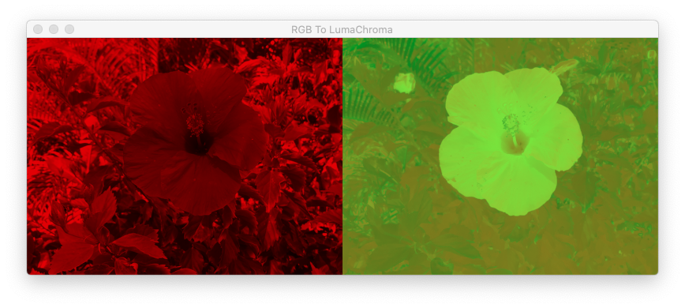
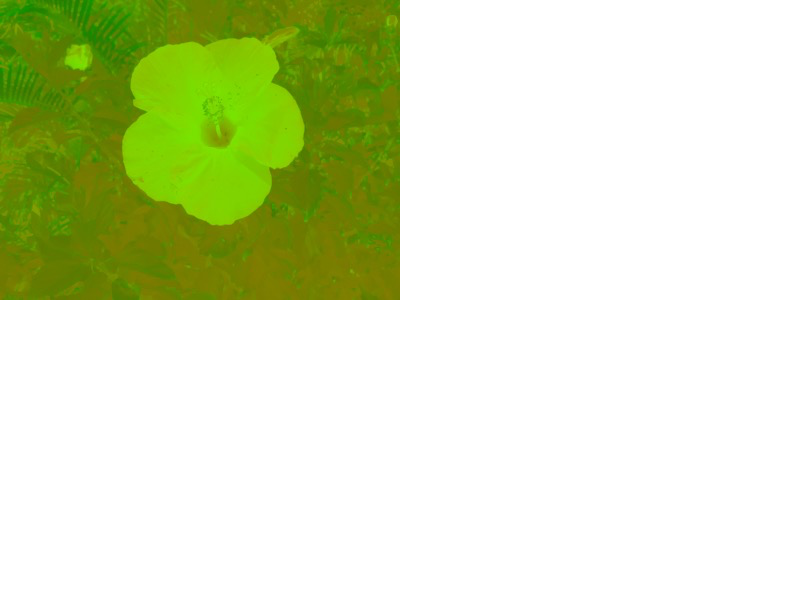

## Using Metal Shaders to convert an RGB graphic to 2 yuv images and convert back to a RGB image.
 
 
 

a) Run the demo **RGB2LumaChroma** to produce and save the luminance and chrominace textures of the original graphic to disk. You will have to move/copy the 2 graphic files to a folder of this project for import into the **Resources** folder of the 2nd demo.
 
 
 

Expected Output:

 
 

To see the generated *Luminance* and *Chrominance* textures, press on the `Capture GPU frame` icon.

 
 
 

b) Run the demo **LumaChroma2RGB**  to reproduce the original graphic.

 
 

This demo expects the following files **luma.jpg** and **chroma.jpg** to be in its **Resources** folder. The two files were previously written out by the first demo.

 
 

The width and height of the chroma texture are 1/2 those of the luma texture. In order for the Metal function `YCbCrColorConversion` to convert these 2 textures back to an RGB texture, the texture data of the chroma texture (*srcChromaTexture*) which was loaded from the **Resources** folder (of **LumaChroma2RGB** demo) must be copied to another texture (*destChromaTexture*) which has a width and height that is doubled. This step is necessary or the shader function *rgb2ycbcrColorConversion* will not produce the expected result.

 
 

The following output was captured from a frame of the demo.

 
 
 

### Development Platform

XCode 11.6 running on macOS 10.15

The source code can be ported back to older versions of macOS.

 
 

### Weblinks:

https://stackoverflow.com/questions/57348166/metal-rgb-to-yuv-conversion-compute-shader

https://stackoverflow.com/questions/58175811/how-to-convert-an-rgba-texture-to-y-and-cbcr-textures-in-metal
